Restaurant visitor forecasting
==============================

Examining and forecasting restaurant visitors with regression analysis

Project Organization
------------

    ├── LICENSE
    ├── README.md
    ├── data
    │   ├── processed
    │   └── raw
    │
    ├── models
    │
    ├── notebooks
    │
    ├── reports
    │   └── figures 
    │
    └── src
        ├── data 
        ├── models 
        └── visualization

--------
# Project Walkthrough

## Prompt

The purpose of this project is to explore the Recruit Restaurant Visitor Forecasting kaggle competition data. The project showcases exploratory analysis, time series analysis, and regression modeling. The main question we want to examine is whether we can predict the visitors to the restaurants using only regression analysis and how good could be the fit.

## Getting Data

The source data for the project was downloaded from [the kaggle competition](https://www.kaggle.com/c/recruit-restaurant-visitor-forecasting/data). This competition was launched on November 29th 2017, and have restaurant data spanning 2016 and the first months of 2017.

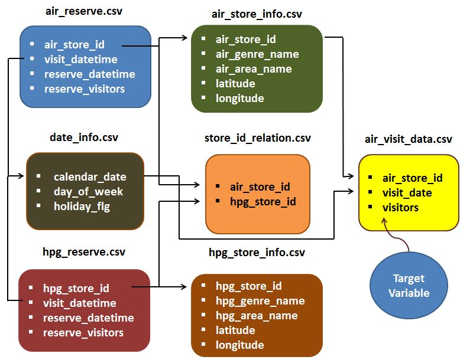

## Cleaning Data

All the data downloaded from the kaggle competition was complete and no obvious errors were found. However, it's noted in the full script that the test data to predict has more restaurants than the train data given by the competition, so different models had to be used in order to get the best possible result for each kind of data. 

After exploring the data with Pandas Profiles, the 7 files provided were merged into a single dataframe and it was then divided into train data and test data.

The pandas profiling package gave useful insights on the various features. After merging all the data files, we could verify that the data was actually quite clean and only a percentage of the rows were missing the visitors variable, only because those are rows with reserved visitors but out of the train dates.

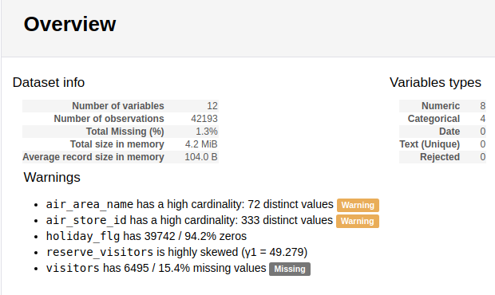

## Exploratory Data Analysis

I started by visualizing violin plots of the visitors distribution for each day of the week, differentiating if it is a holiday or not. We can see that, as expected, Monday through Thursday, the distribution of visitors is much lower than Friday to Sunday. Also, the holiday flag plays a big role in the visitor number, but that role seems to have a bigger effect on weekdays.

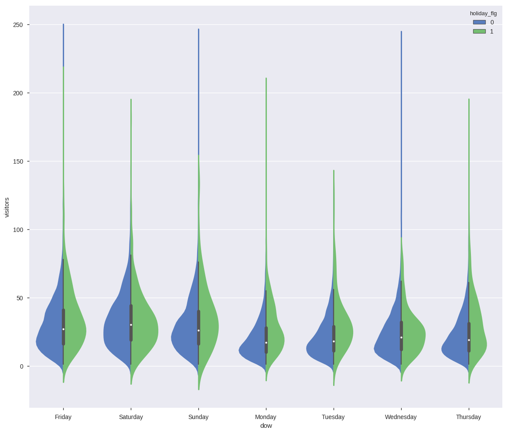

Then, I explore the relationship between the reserve visitors and the actual visitors, where there seems to be a strong relationship, with a p of 0, so we can reject the null hypothesis of both variables being independent, and a Pearson correlation coefficient of 0.42.

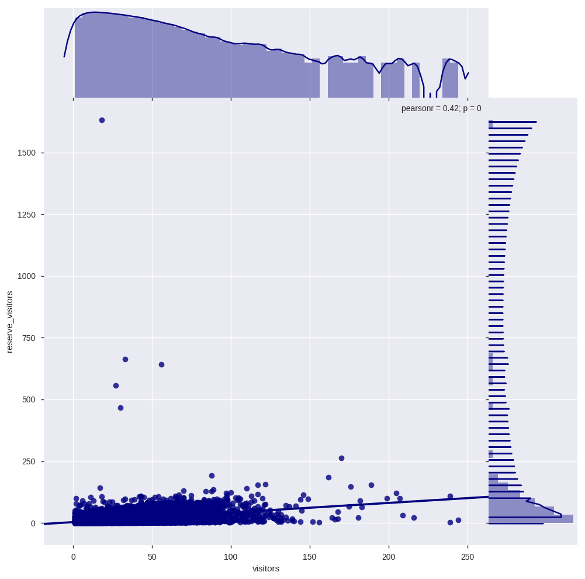

I also inspect the visitors affluence to the restaurants depending on the month of the year, both for each month of the data date range and the average per month.

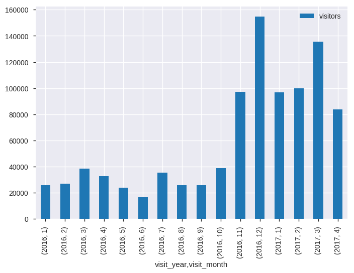
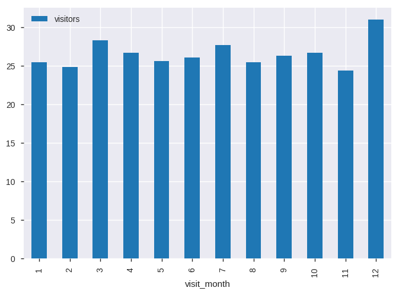 

Finally, I show the evolution of visitors per day of the week for each month.

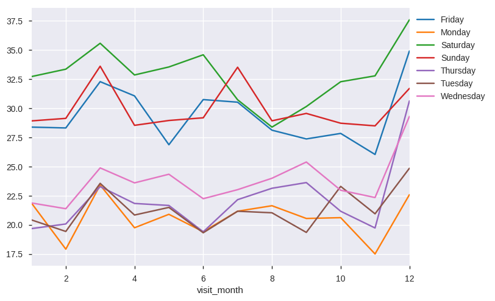

## Regression Analysis

Moving on to modeling, I wanted to examine whether I would be able to predict the number of visitors for a restaurant using the provided data and only with regression analysis. I created a new variable called past day of week visitors, which stores the visitors for each restaurant the last similar day of the week. That variable, together with the reserved visitors, proved to have a prediction power with p=0 and high t-statistics. When testing for polynomial regression goodnes, no fit was found to be improved with the polynomial regression:

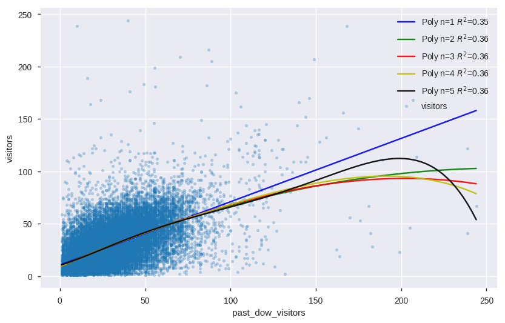

Further analysis of all variables was done using best subset selection. Here is the visual comparison of RSS, R-Squared, AIC and BIC.

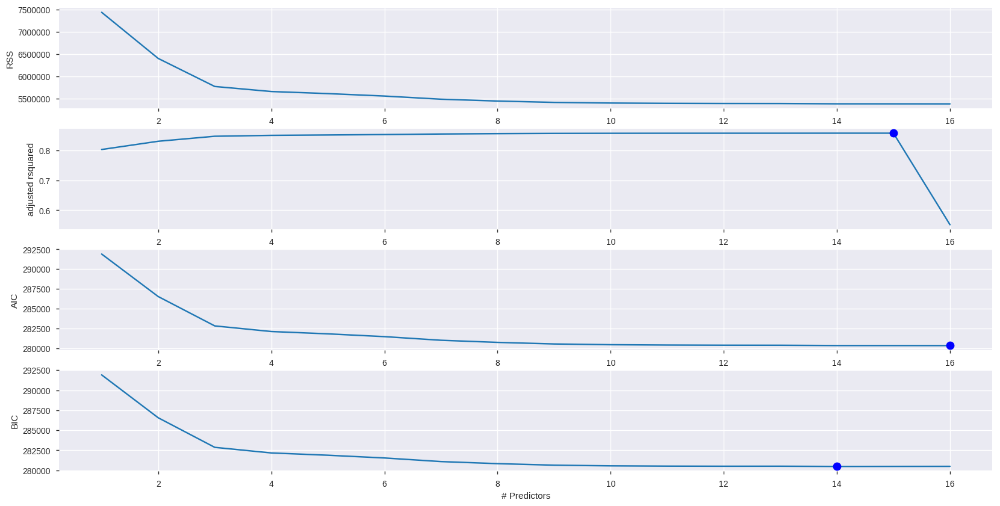

Also, it was inspected the improvement of creating a model for each restaurant id, which proved to be a much better fit, as we can see in the figures in the graph below.

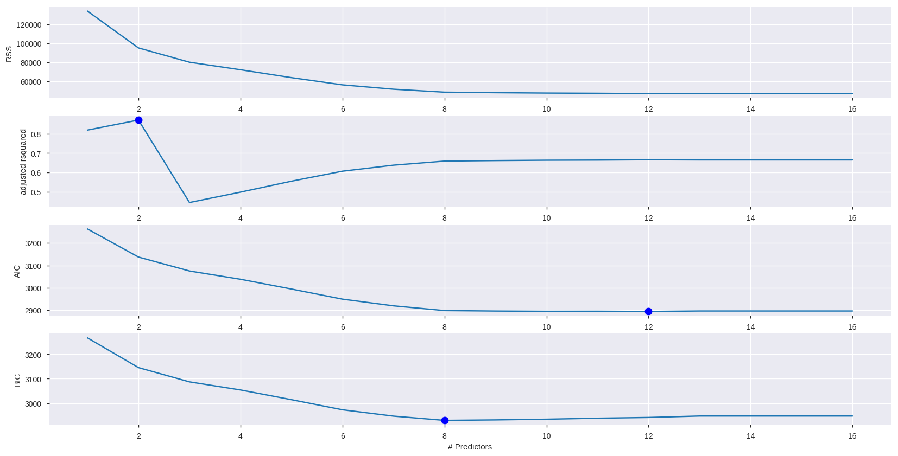

Hence, a model was made for each restaurant.

## Time Series Analysis

I started off by looking at the visitors plot for a single restaurant to identify the time series frequency.

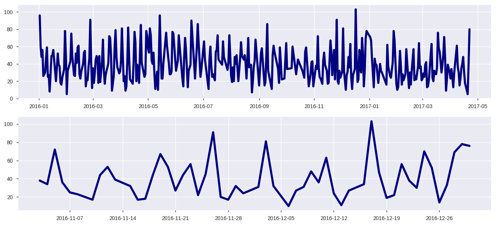

After it was identified to have a 6-7 day frequency period, depending on if the restaurant opened every day or not, a time decomposition was made to try to improve the fit of the previous models, although this decomposition proved to not be able to enhance the fit figures.

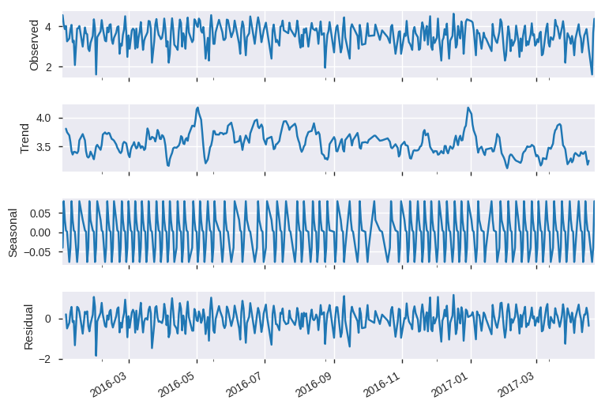

## Conclusions

This was merely a regression analysis to find out the possibility of preciting the visitors of each restaurant in a group of them using the data provided by the Kaggle competition and using no complex Machine Learning model. It proved to be difficult and the models didn't have great Kaggle ratings mostly because, out of the 821 restaurants in the test data, only 331 of them were in the train data and had properly made models, so the rest of them had to be predicted using non-tailored models.
